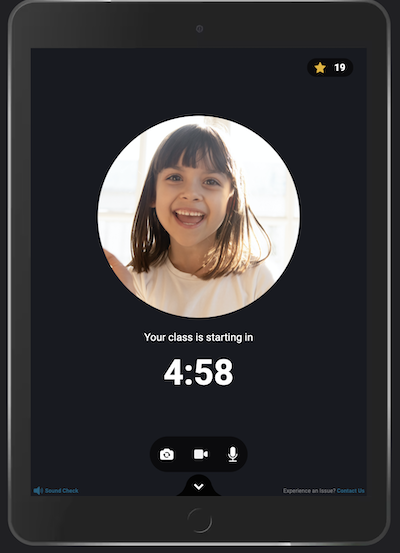

#Technical Frontend Test

<em>1. How long did you spend on the coding test?</em>

    4-5 hours.
    I wanted to make a cool prototype, clean and responsive for all device.

<em>2. Please, describe your approach, and anything you want us to know.</em>

    For this simple prototype, I wanted to show how CSS is powerful.
    Before make all code in JavaScript, it's better to make a simple example on HTML / CSS.
    Less code, more simple.

<em>3. What would you add to your solution if you had more time? If you didn’t spend much time on the coding test then use this as an opportunity to
explain what you would add.</em>

    If I have more time I would like to make:
    1. more smooth animations / transitions for text and stars. 
    2. add en "bubble effect" to the dropdown
    3. add "win sound" when the star is incremented
    4. more responsivity for "landscape mode".

Thanks for watching!

        
